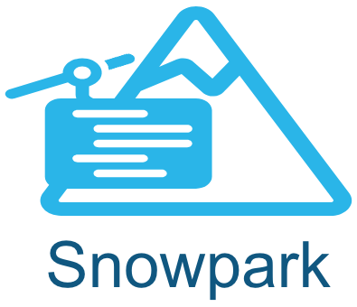

<p float="left">
  
   
</p>
    
### Status: This provider is currently in development and should not be used with production data.
  
# Airflow Provider for Snowpark
This guide demonstrates using Apache Airflow to orchestrate a machine learning pipeline leveraging Airflow Operators and Decorators for Snowpark Python as well as a new customer XCOM backend using Snowflake tables and stages.  While this demo shows both the operators and the xcom backend either can be used without the other.

At a high level [Astronomer's Snowflake Provider](https://github.com/astronomer/astro-provider-snowflake) provides the following:

- Snowpark operators and decorators: [Snowpark Python](https://docs.snowflake.com/en/developer-guide/snowpark/python/index) provides an intuitive Dataframe API as well as the ability to run python-based User-Defined Functions and Stored Procedures for processing data in Snowflake. The provider includes operators and decorators to simplify data passing, remove boiler-plate setup and teardown operations, and generally simplify running Snowpark python tasks. 

Example:
```python
@task.snowpark_python(task_id='feature_engineering', temp_data_output='stage', temp_data_stage='MY_STAGE')
def feature_engineering(taxidf:SnowparkTable) -> list[SnowparkTable]:

	taxidf = taxidf.with_column('HOUR_OF_DAY', F.col('HOUR').cast(T.StringType()))

  new_df = snowpark_session.create_dataframe(pd.DataFrame(['x','y'], columns=['name']))

  return [taxidf, newdf]
```
  
All operators include the following functionality:  
-  __Snowpark Session__: A session instance called `snowpark_session` is automatically created (using Airflow Snowflake connection parameters) and can be referenced by user python code.
-  __SnowparkTable Object__: A new datatype was created that represents a SnowparkTable. This is serializable and can be passed between tasks. Any arguments of the python function which are annotated as `SnowparkTable` will be automatically instantiated as Snowpark Dataframes in the users code. Additionally the SnowparkTable is interchangeable with [Astro SDK Table and TempTable](https://github.com/astronomer/astro-sdk/tree/main) objects.
-  __Snowpark Dataframe serialization and deserialization__: Snowpark Dataframes returned from python functions can be automatically serialized to a Snowflake table or stage as set in `temp_data_output = 'stage'|'table'|None`. The database and stage used for serialization can optionally be set in `temp_data_database` and `temp_data_schema`.  If these are not set the provider will use the database/schema as set in Operator/Decorator parameters, the Airlfow Snowflake connection and lastly the default database/schema in Snowflake user settings.  Snowpark Dataframes serialized to stage will be saved as Parquet files.  Table/Stage data will be deserialized automatically as Snowpark Dataframes in the receiving task.

See [below](#available-snowpark-operators-and-decorators) for a list of all Operators and Decorators.
  
-  __The custom XCOM backend__: To provide additional security and data governance the Snowflake XCOM backend allows storing task input and output in Snowflake. Rather than storing potentially-sensitive data in the Airflow XCom tables Snowflake users can now ensure that all their data stays in Snowflake.  This also allows passing large data and/or non-serializable data (ie. Pandas dataframes) between tasks. JSON-serializable data is stored in an XCom table and large or non-serializable data is stored as objects in a Snowflake stage.

## Package
While in development the provider package is not yet in pypi.  For this demo the provider is installed from a wheel file in `include/astro_provider_snowflake-0.0.1.dev1-py3-none-any.whl' and can be used in other projects by copying this file.
  
# Demonstration
The following demo has been created to show the use of this provider and leverages the Astronomer Runtime and Astro CLI to create a local dev instance of Airflow.

## Prerequisites  
  
- Astro [CLI](https://docs.astronomer.io/astro/cli/get-started)
- Docker Desktop
- Git
- Snowflake account: For this demo a free tier [trial account](https://signup.snowflake.com/) will suffice.

## Setup  
  
1. Install Astronomer's [Astro CLI](https://github.com/astronomer/astro-cli).  The Astro CLI is an Apache 2.0 licensed, open-source tool for building Airflow instances and is the fastest and easiest way to be up and running with Airflow in minutes. Open a terminal window and run:

For MacOS  
```bash
brew install astro
```
  
For Linux
```bash
curl -sSL install.astronomer.io | sudo bash -s
```

2. Clone this repository:
```bash
git clone https://github.com/astronomer/airflow-snowpark-demo
cd airflow-snowpark-demo
```
  
3. Save your Snowflake account credentials as environment variables. Edit the following strings with your account information and run the export command in the terminal window where you will run the remaining commands.
```bash
export AIRFLOW_CONN_SNOWFLAKE_DEFAULT='{"conn_type": "snowflake", "login": "USER_NAME", "password": "PASSWORD", "schema": "demo", "extra": {"account": "ORG_NAME-ACCOUNT_NAME", "warehouse": "WAREHOUSE_NAME", "database": "demo", "region": "REGION_NAME", "role": "USER_ROLE", "authenticator": "snowflake", "session_parameters": null, "application": "AIRFLOW"}}'
```

4.  Start Apache Airflow:
```sh
astro dev start
```  

5. Connect to the Airflow Scheduler container to setup Snowflake objects for the demo.
```bash
astro dev bash -s
```
Setup the Snowflake database, schema, tables, etc for this demo.  This must be run as a user with admin priveleges.  Alternatively use an existing database and schema or look at the setup scripts and have a Snowflake administrator create these objects and grant permissions.
```bash
python include/utils/setup_snowflake.py \
  --conn_id 'snowflake_default' \
  --admin_role 'sysadmin' \
  --database 'demo' \
  --schema 'demo'
exit
```  
  
6. Run the Snowpark Demo DAG
```bash
astro dev run dags unpause snowpark_demo
astro dev run dags trigger snowpark_demo
```

7. Connect to the Local [Airflow UI](http://localhost:8080/dags/snowpark_demo/grid) and login with **Admin/Admin**  

8. As the DAG runs notice that the XCOM values in the Airflow UI only contain URIs and not the actual data.  
For example:  
`snowflake://myORG-myACCT?&table=DEMO.XCOM.XCOM_TABLE&key=snowpark_demo/load.load_yellow_tripdata_sample_2019_01.csv/manual__2023-06-19T15:41:46.538589+00:00/0/return_value`
  

## Available Snowpark Operators and Decorators:

- `SnowparkPythonOperator`: This is the simplest operator which runs as a PythonOperator in the Airflow instance.  This requires that the Airflow instance is running a version of python supported by Snowpark and has Snowpark Python package installed. NOTE: Currently Snowpark only supports python 3.8 so this operator has limited functionality.  Snowpark python for 3.9 and 3.10 is expected soon.
- `SnowparkVirtualenvOperator`: This operator creates a python virtualenv to run the python callable in a subprocess.  Users can specify python package requirements (ie. snowflake-snowpark-python).  It is assumed that the python version specified is installed.  The [Astronomer buildkit](https://github.com/astronomer/astro-provider-venv) can be used to add this to a Docker container.
- `SnowparkExternalPythonOperator`: This operator runs the Snowpark python callable in a pre-existing virtualenv. It is assumed that Snowpark is already installed in that environment. Using the [Astronomer buildkit](https://github.com/astronomer/astro-provider-venv) will simplify building this environment.
- `SnowparkPythonUDFOperator`: Work in progress
- `SnowparkPythonSPROCOperator`: Work in progress
- `snowpark_python_task`: Decorator for SnowparkPythonOperator
- `snowpark_virtualenv_task`: Decorator for SnowparkVirtualenvOperator
- `snowpark_ext_python_task`: Decorator for SnowparkExternalPythonOperator
